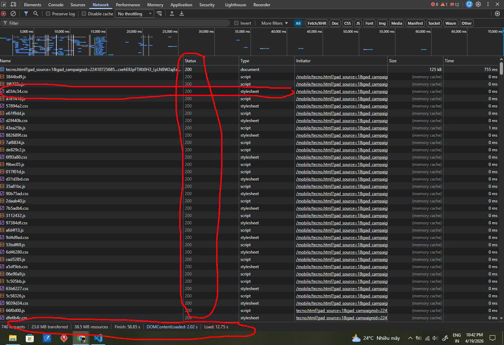

Câu A1:
1. Các bước xảy ra gồm:
B1: Trình duyệt thực hiện DNS Lookup để tìm địa chỉ IP của máy chủ shopee.vn.
B2: Thiết lập kết nối TCP/IP (và TLS Handshake để bảo mật HTTPS) giữa máy tính của bạn và server Shopee.
B3: Trình duyệt gửi một HTTP Request (phương thức GET) để yêu cầu dữ liệu từ máy chủ.
B4: Server xử lý và gửi trả về một HTTP Response (bao gồm mã trạng thái như 200 OK và nội dung file HTML).
B5: Trình duyệt nhận các file (HTML, CSS, JS) và thực hiện quá trình Render để hiển thị giao diện lên màn hình.
2. - Tab network cho tha thấy những thông tin:
        + Danh sách các request
        + Chi tiết các thông tin của request
        + Các tài nguyên được gửi về (CSS, JS, IMG, FONT,...)

Câu A2:
1. Trang web hiện tại bị đánh giá SEO thấp vì mắc lỗi lạm dụng thẻ 
 (thường gọi là "Div-itis"). Google và các công cụ tìm kiếm sử dụng các thẻ Semantic (thẻ có ý nghĩa) để lập chỉ mục và hiểu nội dung. Khi toàn bộ trang web chỉ sử dụng 
, công cụ tìm kiếm sẽ gặp các vấn đề sau:
    - Không xác định được cấu trúc: Google Bot không biết đâu là phần quan trọng nhất, đâu là phần đầu trang hay chân trang.
    - Thiếu từ khóa tiêu đề: Các thẻ tiêu đề (<h1>, <h2>) là tín hiệu cực kỳ quan trọng để SEO tên sản phẩm.
    -  Khả năng tiếp cận kém: Các thiết bị hỗ trợ người khiếm thị không thể đọc hiểu được mục đích của các thành phần trên trang.
2. Các lỗi Semantic cụ thể và cách sửa lại:
- Lỗi 1: Sử dụng 
 cho phần đầu trang.
    Sửa lại: Thay bằng thẻ <header>. Thẻ này giúp định danh phần chứa logo và bộ công cụ của trang web.
- Lỗi 2: Sử dụng 
 cho thanh điều hướng.
    Sửa lại: Thay bằng thẻ <nav>. Đây là tín hiệu để Google biết các liên kết bên trong là hệ thống menu chính.

- Lỗi 3: Các mục menu con đang dùng thẻ 
 đơn lẻ.
    Sửa lại: Thay bằng cấu trúc danh sách <ul> (Unordered List) và <li> (List Item). Đây là quy chuẩn để trình bày các tập hợp liên kết điều hướng.
- Lỗi 4: Tên sản phẩm dùng 
.
    Sửa lại: Thay bằng thẻ tiêu đề <h1> (hoặc <h2>). Tiêu đề chứa từ khóa chính là yếu tố sống còn để sản phẩm xuất hiện khi người dùng tìm kiếm.
- Lỗi 5: Phần chân trang dùng 
.
    Sửa lại: Thay bằng thẻ <footer>. Giúp Google tách biệt phần nội dung chính với phần thông tin bản quyền và liên hệ.
3. Sửa mã nguồn:
<header>
    
ShopTLU

    <nav>
        <ul>
            <li><a href="/">Trang chủ</a></li>
            <li><a href="/products">Sản phẩm</a></li>
        </ul>
    </nav>
</header>

<main>
    <article class="product">
        <h1>iPhone 16 Pro</h1>
        
25.990.000đ

        <figure>
            
        </figure>
    </article>
</main>

<footer>
    <small>© 2026 ShopTLU - All Rights Reserved</small>
</footer>
Câu A3:
Sơ đồ:
    Hộp 1
    Text A Text B
    Hộp 2
    Text C Text D
    Hộp 3
Giải thích:
    Kết quả trên được hình thành dựa trên hai quy tắc hiển thị chính trong HTML:
    Phần tử Block (Thẻ 
):
    Các thẻ 
 là phần tử khối. Đặc điểm của chúng là luôn bắt đầu trên một dòng mới và chiếm toàn bộ chiều ngang khả dụng của trình duyệt.
    Vì vậy: "Hộp 1", "Hộp 2" và "Hộp 3" mỗi cái nằm riêng biệt trên một dòng.
    Phần tử Inline (Thẻ  và <strong>):
    Các thẻ  và <strong> là phần tử nội dòng. Chúng không bắt đầu trên dòng mới mà chỉ chiếm khoảng không gian vừa đủ với nội dung bên trong. Các phần tử inline sẽ nằm sát cạnh nhau trên cùng một dòng cho đến khi hết chiều rộng màn hình.
    Vì vậy: "Text A" và "Text B" sẽ đi liền nhau trên một dòng. Tương tự, "Text C" và "Text D" cũng nằm cạnh nhau trên một dòng.
Câu A4: Cấu trúc Table và Layout trang web:
1. Sự khác nhau giữa <thead>, <tbody>, và <tfoot>:
    Các thẻ này giúp phân chia bảng thành các phần logic rõ ràng, giúp trình duyệt và các thiết bị hỗ trợ hiểu được cấu trúc dữ liệu:
    <thead> (Table Header): Dùng để bao nhóm các hàng chứa tiêu đề của các cột. Khi bảng quá dài và phải in ra nhiều trang, trình duyệt thường lặp lại phần header này ở đầu mỗi trang để người dùng dễ theo dõi.
    <tbody> (Table Body): Chứa nội dung chính (dữ liệu) của bảng. Một bảng có thể có nhiều <tbody> để phân nhóm các tập dữ liệu khác nhau.
    <tfoot> (Table Footer): Dùng để bao nhóm các hàng tổng kết (ví dụ: tổng tiền, ghi chú cuối bảng). Thông thường, footer sẽ hiển thị ở dưới cùng của bảng.
2. Tại sao KHÔNG NÊN dùng table để tạo layout trang web?
Lý do:
     Khó đáp ứng giao diện linh hoạt (Responsive): Table được thiết kế để hiển thị dữ liệu dạng hàng và cột cố định. Việc ép một cái table hiển thị tốt trên cả màn hình máy tính rộng và màn hình điện thoại dọc là cực kỳ khó khăn so với việc dùng CSS (Flexbox hoặc Grid).
    Ảnh hưởng đến hiệu suất (Performance): Trình duyệt thường phải đợi tải xong toàn bộ nội dung của table thì mới có thể tính toán kích thước và hiển thị lên màn hình. Điều này khiến người dùng cảm thấy trang web load chậm hơn.
    Tệ cho SEO và Accessibility: Các công cụ tìm kiếm (như Google) sẽ gặp khó khăn khi cố gắng đọc hiểu nội dung trang web nếu các đoạn văn bản bị chia nhỏ vào các ô bảng. Ngoài ra, trình đọc màn hình cho người khiếm thị sẽ đọc table theo thứ tự hàng/cột, khiến nội dung trang web trở nên lộn xộn, không logic.